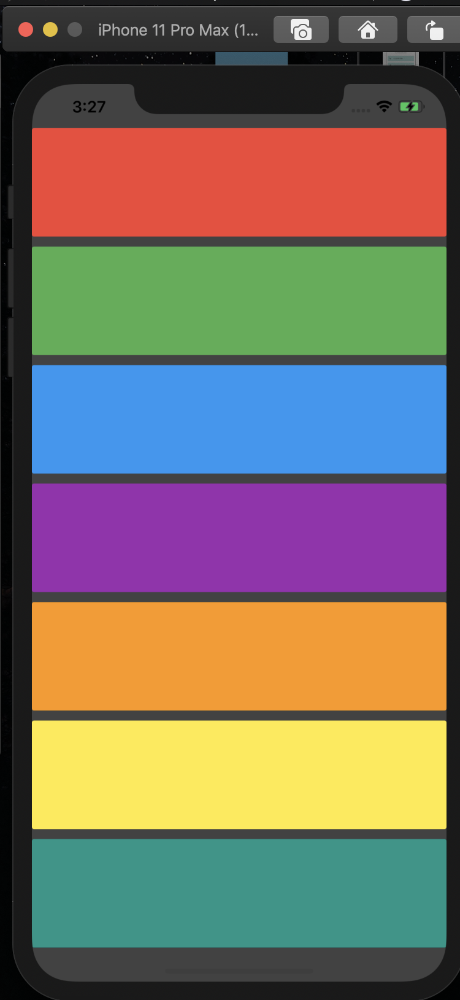

# xylophoneapp
A simple iOS app built using Flutter. This project was built as part of a learning exercise from https://github.com/londonappbrewery

## Steps

1. Clone the repo
2. Install any packages using: `flutter packages get`
3. `cd` into the project
4. Run: `flutter run`

The final app will look like:

